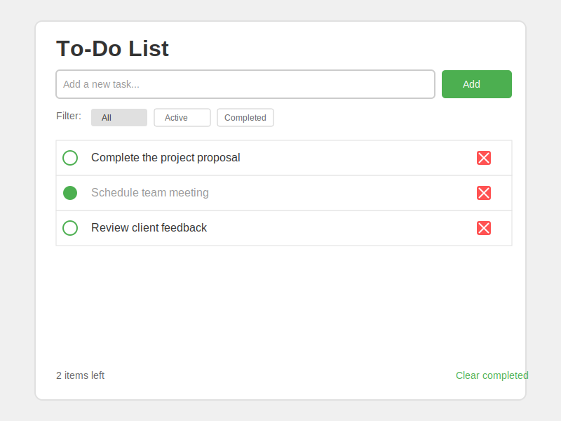

# Next-Todo-List

-- By Claude

優先開發核心功能，Footer、Filter留後

## Start
參考make file
```bash
make up
```

詳細可看
```bash
make help
```

NOTE:
- 專案如果有新套件、新model設定都需要重啟container(`make rebuild`)：直接套用本地會因為環境不一造成套件依賴錯誤

## Develop Concept Road Map
- 建置基本Code Base框架
- 建置開發環境
  - docker
  - db with prisma
- 建置部署準備
  - production dockerfile
- 建置資料夾結構
- 開發畫面 -> 開發資料流 -> 串接資料流 -> 優化
  - TODO
- 程式碼檢查、優化

## Modified
- fix typescript error: upgrade "eslint-config-next"
- use eslint-prettier for better DevX


## Expect To Add
- server side logger: pino, winston...etc